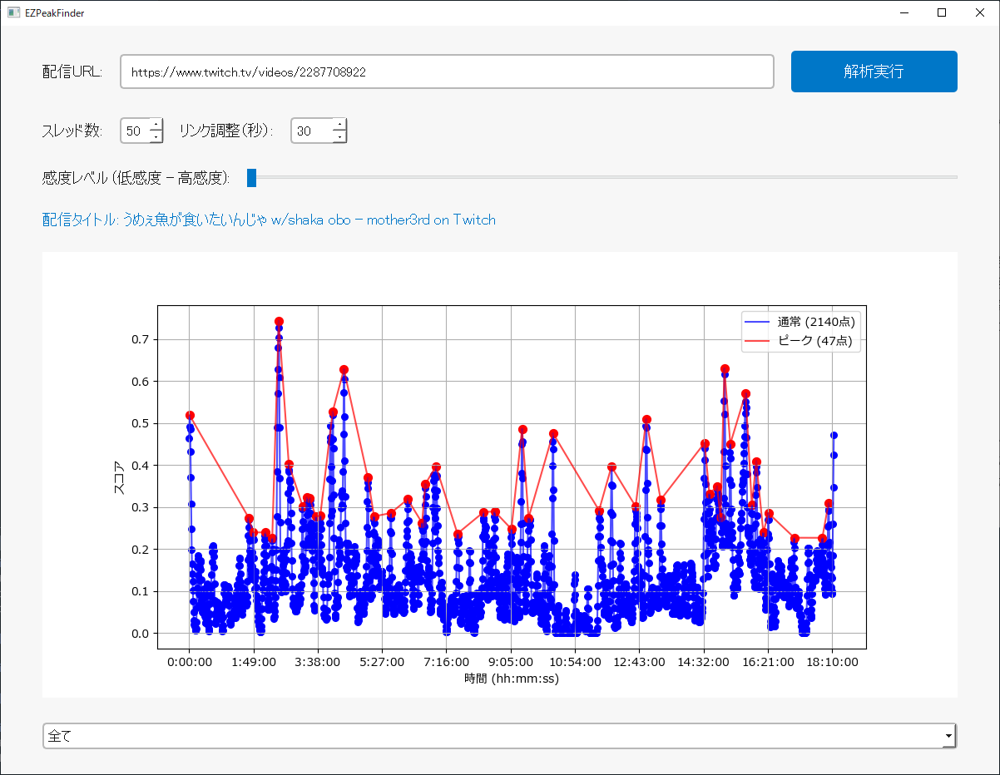

# EZPeakFinder

[![Downloads][downloads-shield]][downloads-url]

EZPeakFinderは、Twitchのライブ配信における「盛り上がり」を視覚化するツールです。配信チャットのコメント数やその多様性、バースト性（急激な増加）をもとに、視聴者が最も反応している瞬間を特定し、グラフで可視化します。



## こんな使い方が出来ます

- **推しの配信を追いたい**: 忙しい生活の中でも、盛り上がっているところをすぐに確認することが出来ます。
- **切り抜きを作っている方**: 使用するシーンを素早くピックアップし、編集のクオリティ向上に時間を掛けることが出来ます。
- **分析と統計**: 自らの配信をチェックすることで、リスナーがどのような場面に興味を持つか振り返ることが出来ます。

## 特徴

- **簡単な操作性**: アーカイブのURLを入力し、感度レベルを左右に操作するだけ！細かい調整はプログラムによって行われます。
- **便利なリンク機能**: グラフに表示されているドットをクリックすると、当該タイムスタンプが付与されたURLをブラウザで表示することが出来ます。

## セキュリティと信頼性

EZPeakFinderはオープンソースソフトウェアで、ソースコードは誰でも確認・変更できます。オープンソースの利点は、誰でもコードをレビューできる点であり、これによりソフトウェアの透明性と信頼性が確保されています。

### Windows Defender SmartScreenによる警告について

Windows Defender SmartScreenは、あまり知られていないソフトウェアを実行しようとしたときに警告を表示するセキュリティ機能です。
EZPeakFinderをダウンロードして実行しようとした際、「WindowsによってPCが保護されました」というメッセージが表示されることがありますが、これはソフトウェア自体に問題があるわけではありません。この警告は、主にそのソフトウェアが広く認識されていない場合に表示されます。

EZPeakFinderはオープンソースソフトウェアで、GitHubリポジトリでソースコードを公開しており、誰でも確認できます。もし心配な場合は、ソースコードを直接確認し、自分でビルドして使用することもできます。それでも警告が表示される場合は、信頼できるソースからのソフトウェアであることをご理解いただき、警告を無視して実行していただくことをお勧めします。

もしソフトウェアに不安がある場合や、Windows Defender SmartScreenの警告を避けたい場合は、GitHubのリポジトリからソースコードをダウンロードし、自分でビルドすることができます。以下の手順で、簡単にビルドができます。

## 導入方法

### ビルド済み実行ファイル:
**自分でプログラムをビルドしない方向け**
1) [このページ](https://github.com/YNZjp/EZPeakFinder/releases/latest)からビルドされた実行ファイル（exe）を含むZIPファイルをダウンロードできます。
2) ダウンロードしたZIPファイルを解凍し、中に含まれているEZPeakFinder.exeを実行してください。

### 自分でビルドする:
**ソースコードからビルドを行う方向け**
1) リポジトリをクローンします。
    ```bash
    git clone https://github.com/YNZjp/EZPeakFinder.git
    ```
2) 必要な依存関係をインストールします。
    ```bash
    cd EZPeakFinder
    pip install -r requirements.txt
    ```
3) PyInstallerを使用して実行ファイルをビルドします。
    ```bash
    pyinstaller --onefile --noconsole --icon=assets/Logo.ico --name=EZPeakFinder main.py
    ```
    `dist/` フォルダ内に `EZPeakFinder.exe` が作成されます。

## 使用方法

1. **配信URLを入力**: Twitchの配信URLを入力します。
2. **スレッド数を設定**: チャットをダウンロードするコネクション数を指定します。デフォルトは10で、長時間アーカイブなどで時間が掛かるようであれば増やしてください。
3. **リンク調整を設定**: グラフに表示されているドットにはタイムスタンプが付与されますが、生成するタイムスタンプをどれくらい前に調整するかを設定します。チャットが増えるタイミングと実際に盛り上がりシーンが起こったタイミングには時差があるので、その微調整のためのパラメータです。
4. **解析実行**: 「解析実行」ボタンをクリックして、配信データを解析します。
5. **結果確認**: 解析後、グラフ上に盛り上がりのグラフが表示されます。感度レベルのスライダーを調査することでピークの検知感度を変更することが出来ます。

## 盛り上がり検知アルゴリズム

EZPeakFinderでは、配信中の「盛り上がり」を検出するために、以下の3つの要素を使っています。これらを組み合わせることで、視聴者が最も反応している瞬間を見つけます。

### 1. コメントの頻度
コメントがたくさん投稿されるほど、その瞬間が盛り上がっていると考えます。たとえば、配信中に急に多くのコメントが集まったら、それが盛り上がりの証拠です。

### 2. コメントの多様性
コメントに使われる言葉の種類が多ければ多いほど、視聴者が様々な反応をしていることを意味します。たとえば、特定の話題に対して多くの人が異なる意見を述べている時などです。

### 3. コメントの急増（バースト性）
コメントが急激に増える瞬間を「バースト」と呼び、これが「盛り上がり」の指標になります。視聴者が一気に反応する瞬間を捉えます。

これらの要素を基に、配信中の最も盛り上がった瞬間（ピーク）を動的に検出します。動的閾値補正や局所正規化を利用し、過密ゾーンと過疎ゾーンの両方に対応しています。

## ライセンス

MIT License

Copyright (c) 2024 YNZ

このソフトウェアはMITライセンスの下で配布されており、商用利用や改変も自由に行うことができます。

## 注意

現在このソフトウェアはWindowsのみサポートしています。

## 開発者

**YNZ**
- X: [YNZjp](https://x.com/YNZjp)
- Twitch: [YNZw](https://www.twitch.tv/YNZw)
- GitHub: [YNZjp](https://github.com/YNZjp)

## Special Thanks

このプロジェクトを制作するにあたり、Twitchのチャットダウンロードに関する処理について、以下のプロジェクトを大変参考にさせていただきました。
In the development of this project, I have greatly benefited from the following project, especially for handling the Twitch chat download process.

[TwitchDownloader by lay295](https://github.com/lay295/TwitchDownloader)


[downloads-shield]: https://img.shields.io/github/downloads/YNZjp/EZPeakFinder/total?style=for-the-badge&logo=github
[downloads-url]: https://github.com/YNZjp/EZPeakFinder/releases/latest
